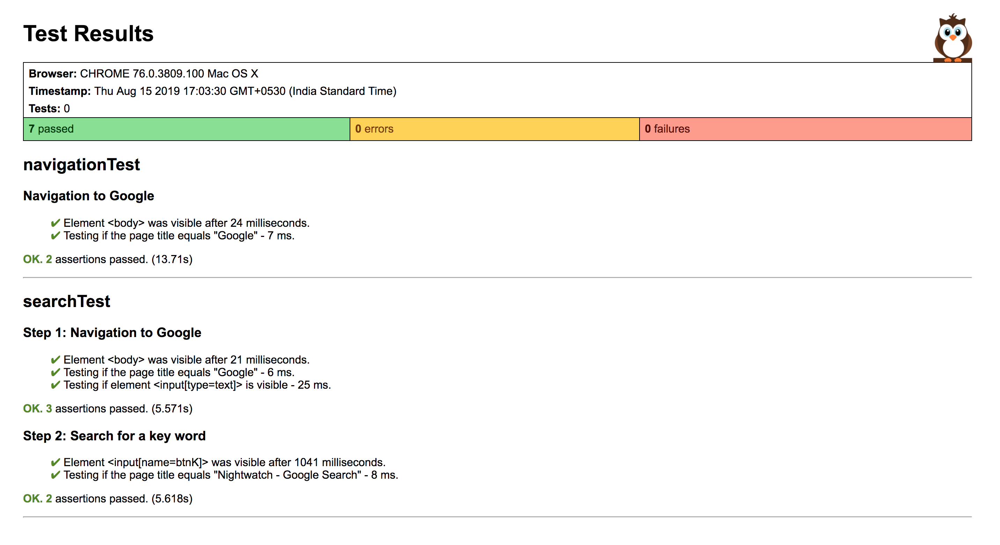

# nightwatch-poc

### Waht is Nightwatch ?

[Nightwatch](https://nightwatchjs.org/) is an automated testing framework for web applications and websites, written in Node.js and using the W3C WebDriver API (formerly Selenium WebDriver. It is a complete browser (End-to-End) testing solution which aims to simplify the process of setting up Continuous Integration and writing automated tests.

This is a sample nightwatch project to run your functional tests programmatically.

### Setup 

* Install node via `brew install node` Or download [Node.js](https://nodejs.org/en/download/)

* Do  `git clone https://github.com/NageshJoy007/nightwatch-poc.git`

* To download required node_modules specified in [package.json](./package.json)  `npm install`

### Run

Go into project folder and run below commands:

1) To run tests using scripts in package.json

`npm test`

2) To run your tests by default : on firefox

`nightwatch ./tests`

3) To run your tests using specific browser

`nightwatch ./tests -e chrome`   

4) To run your tests & generate html reports

`nightwatch -e chrome ./tests --reporter html-reporter.js`

5) To run your tests on two different browsers parallelly

`nightwatch -e chrome,firefox ./tests --reporter html-reporter.js`

6) To run your tests using specific tag

`nightwatch -e chrome --tag smoke ./tests --reporter html-reporter.js`

### Output

Reports will generate under tests_output folder

